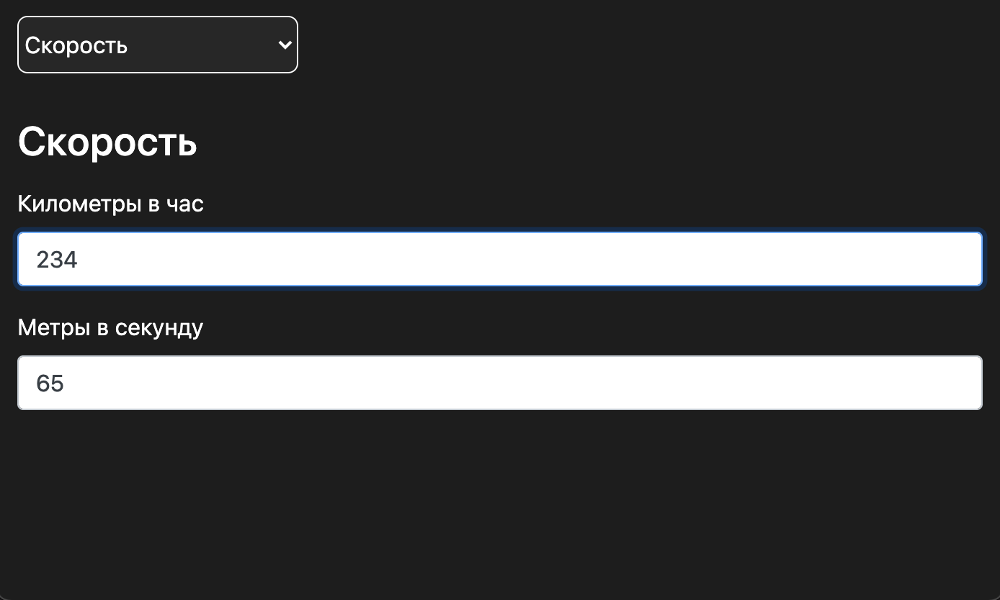
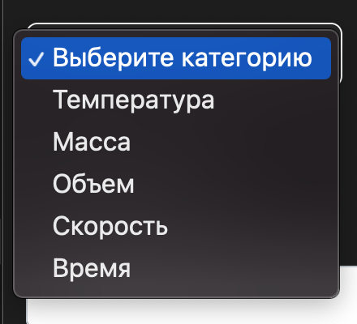

# Value Converter
## Конвертер величин

Приложение Value Converter - десктопное приложение, созданное для быстрого перевода различных величин в разные единицы измерения.
Программа использует технологию ElectronJS - JavaScript-фреймворк, используемый различными популярными сервисами (например, Discord, Skype, Telegram Desktop)

В проекции используются современные технологии непрерывной доставки и непрерывной интеграции CI/CD на основе GitHub Actions.
Протестировать данный проект.

## Пример (скорость)

## Величины

